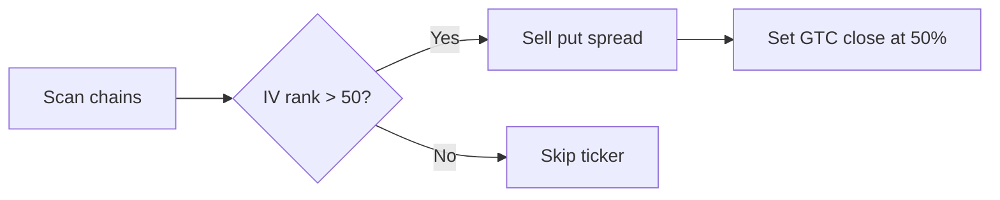

# Markable Feature Demo

Everything below renders natively — try **⌘2** for split mode and edit this file live.

## Syntax highlighting

```python
def kelly_fraction(p: float, b: float) -> float:
    """Optimal bet size given win probability p and odds b."""
    return (p * (b + 1) - 1) / b
```

```swift
let premium = contracts.map(\.midPrice).reduce(0, +)
print("Total credit: \(premium)")
```

## Mermaid diagrams



## Task lists

- [x] View mode
- [x] Edit mode
- [x] Split mode with live preview
- [ ] Your feature request here

## Footnotes

The wheel strategy works best on tickers you'd own anyway.[^1]

[^1]: Selling puts on stocks you don't want assigned is picking up pennies in front of a steamroller.

## Tables

| Ticker | Strategy | Delta |
|--------|----------|-------|
| SPY    | Put credit spread | 0.16 |
| AMD    | Covered call | 0.30 |

> Blockquotes, `inline code`, and [links](https://daringfireball.net/projects/markdown/) all work too.

_Auto-refresh test line — 15:03:25_
